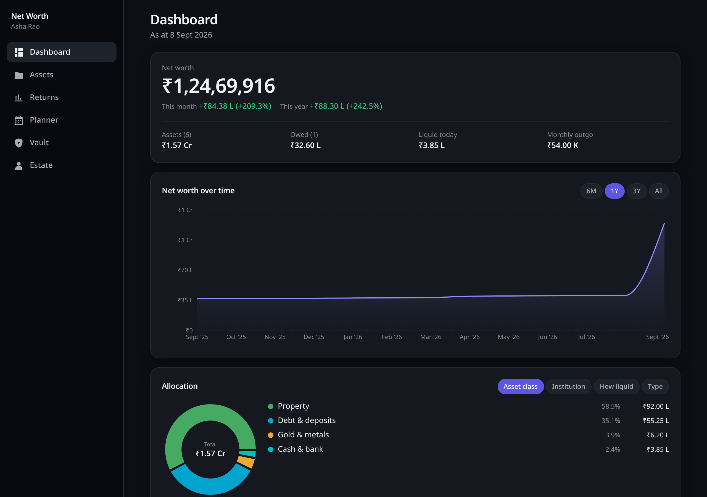
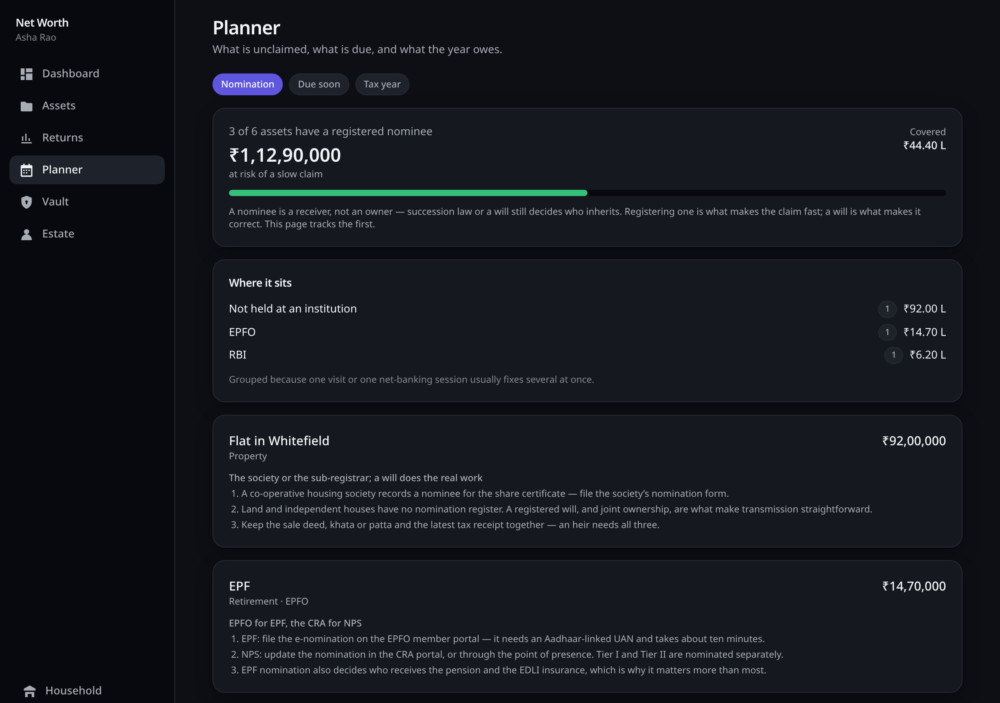
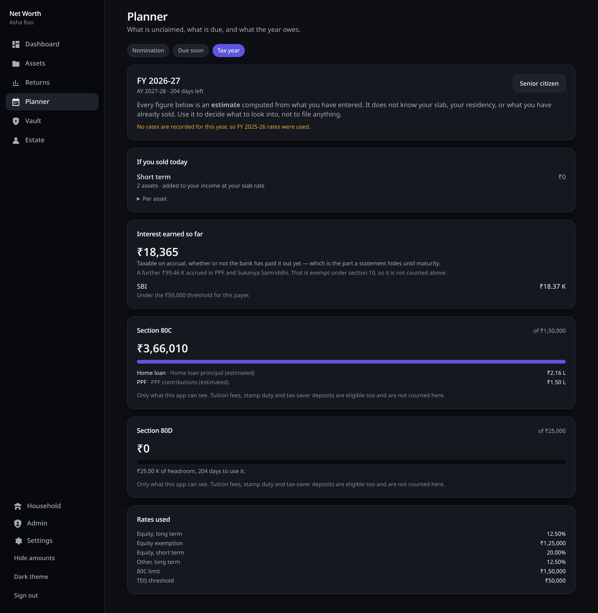
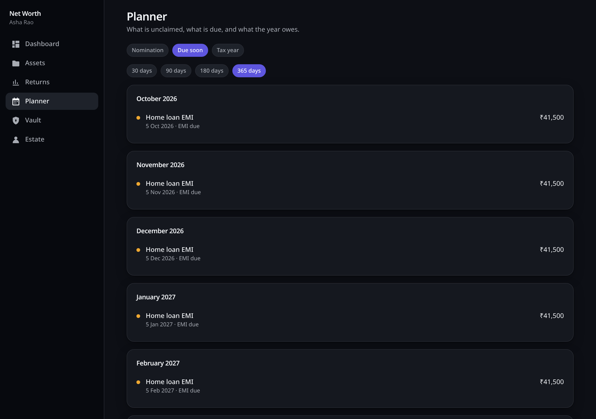

# Net Worth Tracker

A self-hosted net worth tracker built for **Indian households** — every asset and liability
in one place, and a plan for the day someone else has to claim them.

> **Status:** v1.0.0. Every build phase is complete — [`docs/TASKS.md`](docs/TASKS.md) lists
> what is still open, and [`docs/DECISIONS.md`](docs/DECISIONS.md) records why each phase is
> shaped the way it is and what it deliberately left out.

## Why

Indian household wealth is scattered across instruments that no general-purpose tracker
models properly: PPF, EPF, NPS, Sukanya Samriddhi, post-office schemes, LIC endowment
policies, sovereign gold bonds, physical gold, land with survey and khata numbers, and
mutual funds identified by AMFI scheme code rather than a ticker.

And a large share of it goes **unclaimed after a death** — because heirs did not know the
asset existed, no nominee was ever registered, or nobody could find the paperwork. The RBI
runs an entire portal for unclaimed deposits; shares drift to the IEPF; policies lapse.

So this app does two things:

1. **Know what you own** — every asset and liability, valued, charted, with XIRR and
   allocation.
2. **Make sure it can be claimed** — nomination tracking per asset, an encrypted vault for
   credentials and document locations, nominees who can actually log in, and a printable
   claim kit per institution.

## Screenshots

|  |  |
| --- | --- |
|  |  |
| **Dashboard** — what you are worth, where it is, and what would hurt. | **Nomination hygiene** — what an heir could not easily claim, biggest first, with the steps to fix it. |
|  |  |
| **Tax year** — estimates, labelled as estimates, with the rates they used printed underneath. | **Due calendar** — maturities, premiums, EMIs, and the PPF minimum before 31 March. |

Regenerate them after a UI change with `npm run screenshots -w @networth/e2e`, which drives
a real browser against a throwaway database — so they can never be a picture of a version
that no longer exists.

## Features

**Assets** — bank accounts · FD, RD, PPF, SSY, NSC, KVP, MIS, SCSS · mutual funds (auto NAV
from AMFI) · stocks and ETFs · EPF, VPF, NPS · LIC and insurance policies · land and property
· gold, silver, SGB · crypto, ESOPs, chit funds, loans given · and liabilities, because net
worth is assets minus debts.

**Insight** — net worth over time, allocation by class and institution, XIRR and CAGR,
maturity and premium-due calendar, financial-year reporting (Apr–Mar), and clearly-labelled
tax estimates including LTCG/STCG splits and an 80C headroom tracker.

**Succession** — a nomination hygiene dashboard that ranks un-nominated assets by value at
risk, a zero-knowledge vault for credentials, nominee accounts with read-only access, an
optional dead-man switch, and generated claim kits listing the exact forms each institution
wants.

**Email** — optional SMTP, with a Gmail-shaped setup path. Invites and nominee invitations
arrive with a code and a link, new accounts get a welcome, forgotten passwords get a
single-use hourly reset link that still demands your second factor, and the dead-man switch
actually warns you — at 50%, 75% and 90% of your window, again when the grace period opens,
and once more if it ever fires — and those warnings carry a one-click check-in link, so
saying "still here" needs no sign-in. Nothing sends on the request thread: messages go through an
encrypted outbox that retries, and an admin panel shows what went out, what failed and why.

**Household** — partners can merge their data into one household view by mutual consent,
with joint assets split by ownership so nothing is double-counted. Either side can revoke
instantly.

**Yours** — one SQLite file, one-click encrypted backup and restore, JSON and CSV export, no
telemetry, no third-party scripts, no cloud account.

**On your phone** — installable as a PWA with an offline shell, a lakh/crore toggle, and a
privacy blur that hides every amount with one tap (or the `h` key) for checking your net
worth in a queue.

## Quick start

Requires Node 22 or newer (`.nvmrc` pins the tested version).

```bash
git clone <your-repo-url> networth-tracker
cd networth-tracker
npm install

cp .env.example .env
# Generate three distinct secrets and set a bootstrap invite code:
openssl rand -base64 48   # JWT_ACCESS_SECRET
openssl rand -base64 48   # JWT_REFRESH_SECRET
openssl rand -base64 48   # SECRET_ENCRYPTION_KEY

npm run dev
```

The API creates and migrates its SQLite file on first boot — at `apps/api/data/networth.db`,
because the workspace script runs from `apps/api/`. Set absolute paths in `.env` for anything
beyond local development; see [`docs/DEPLOYMENT.md`](docs/DEPLOYMENT.md). To fill an account with a
household's worth of demo assets — deposits, a fund holding with two years of SIPs, a plot
of land, EPF, gold bonds and a home loan — register first, then run
`npm run db:seed -- --email you@example.com`. `SECRET_ENCRYPTION_KEY`
encrypts server-readable secrets at rest (today, TOTP seeds) — **back it up with the
database**, because rotating it makes every enrolled second factor unreadable.

Open http://localhost:5173 and register the first admin account with the
`BOOTSTRAP_INVITE_CODE` you set. Every account after that is created by an admin-issued
invite — there is no open signup.

### Production

```bash
npm run build
npm start          # the API, on API_PORT
```

The API serves **only** `/api` — `npm run build` emits the front end to `apps/web/dist`, and
a reverse proxy serves those static files and forwards `/api` to the Node process. Set
`COOKIE_SECURE=true`; in production the API refuses to start with placeholder secrets or
without it.

### With Docker

If you would rather not have Node on the host at all, one command installs the whole thing.
It needs [Docker](https://www.docker.com/products/docker-desktop) and nothing else:

```bash
curl -fsSL https://github.com/gondhijagapathi/networth-tracker/releases/latest/download/deploy.sh -o networth-deploy.sh
bash networth-deploy.sh
```

It downloads one compose file, **generates the three secrets for you**, asks four questions —
invite code, port, whether an HTTPS proxy sits in front, and a backup passphrase — then pulls
the published images, starts the stack and waits until it answers. Nothing is compiled here,
nothing is cloned, and there is nothing to edit by hand.

You get the API and an nginx serving the front end on `http://localhost:8080`, with the
database, encrypted uploads and backup bundles in `data/` inside the install directory —
a plain directory you can copy, not a Docker volume, and nothing under `/var`.

The same script runs everything afterwards:

```bash
bash networth-deploy.sh status     # is it running
bash networth-deploy.sh logs       # what it is doing
bash networth-deploy.sh backup     # take an encrypted backup now
bash networth-deploy.sh upgrade    # back up, fetch the latest, rebuild, restart
```

`upgrade` takes a backup **before** it touches anything, because database migrations run at
boot and are not reversible. It never overwrites your `.env`.

<details>
<summary>Prefer to drive Compose yourself?</summary>

```bash
git clone https://github.com/gondhijagapathi/networth-tracker.git
cd networth-tracker
cp .env.example .env
# set the three secrets and BOOTSTRAP_INVITE_CODE, as in the source instructions above
docker compose up -d --build
```

Compose pins the container-shaped settings itself — `NODE_ENV`, `COOKIE_SECURE`, the data
paths and the bind address — so those lines in `.env` are ignored for this route.

</details>

Full instructions for every route — an nginx block, a systemd unit, the Compose stack, and a
warning about where the default `data/` paths actually land:
[`docs/DEPLOYMENT.md`](docs/DEPLOYMENT.md).

## API

All routes are under `/api`. Sessions are cookie-based; mutating requests must echo the
`nt_csrf` cookie in an `x-csrf-token` header.

| Method | Route | Purpose |
| ------ | ----- | ------- |
| `GET` | `/auth/bootstrap` | Whether this instance still needs its first account |
| `POST` | `/auth/register` | Redeem an invite code and create an account |
| `POST` | `/auth/login` | Sign in; answers `totp_required` when 2FA is enabled |
| `POST` | `/auth/refresh` | Rotate the refresh token and reissue an access token |
| `POST` | `/auth/logout` | Revoke this session family and clear cookies |
| `GET` | `/auth/me` | The signed-in user |
| `POST` | `/auth/password` | Change password; signs out every device |
| `POST` | `/auth/forgot-password` | Email a reset link. Answers `204` whether or not the address has an account |
| `GET`/`POST` | `/auth/reset-password` | Check a link, then set the new password |
| `GET`/`POST` | `/check-in` | Read an emailed dead-man check-in link, then confirm it. Public; the GET is deliberately inert so mail scanners cannot check you in |
| `GET`/`DELETE` | `/auth/sessions[/:id]` | List signed-in devices; revoke one |
| `POST` | `/auth/2fa/enrol`, `/enrol/confirm`, `/disable` | TOTP enrolment and removal |
| `GET`/`PATCH` | `/admin/users[/:id]` | List accounts; suspend, reactivate, change role |
| `POST` | `/admin/users/:id/revoke-sessions` | Sign a user out everywhere |
| `GET`/`POST`/`DELETE` | `/admin/invites[/:id]` | Issue, list and withdraw invites |
| `GET` | `/admin/mail` | Whether mail is configured, the queue, and recent failures |
| `POST` | `/admin/mail/test` | Send a test message to your own address. Takes no recipient |
| `POST` | `/admin/mail/:id/retry` | Put a failed message back in the queue |
| `GET`/`POST` | `/assets` | List (filter, search, sort, paginate) and create assets |
| `GET` | `/assets/counts` | Counts by type and status, for the list's filter chips |
| `GET`/`PATCH`/`DELETE` | `/assets/:id` | Read, update and archive one asset |
| `GET`/`POST` | `/assets/:id/valuations` | Valuation history; append a new valuation |
| `GET`/`POST` | `/assets/:id/transactions` | Transaction history; record a movement |
| `PATCH`/`DELETE` | `/assets/:id/transactions/:txId` | Correct or remove a transaction |
| `GET`/`POST` | `/instruments[/:id]` | Search the scheme/share catalogue; find or create |
| `GET`/`POST` | `/vault` | Whether a vault exists and how full it is; create one |
| `POST` | `/vault/unlock`, `/unlock/confirm` | Fetch the wrapped key material (metered, audited); report success |
| `POST` | `/vault/rekey` | Change the vault passphrase — rewraps the key, re-encrypts nothing |
| `GET`/`POST`/`PATCH`/`DELETE` | `/vault/items[/:id]` | Encrypted item CRUD; ciphertext only |
| `GET`/`POST`/`DELETE` | `/vault/documents[/:id]` | Encrypted uploads; `/:id/content` streams the ciphertext |
| `GET`/`POST`/`PATCH`/`DELETE` | `/nominees[/:id]` | Name an heir, change what they see, revoke |
| `POST` | `/nominees/:id/invite` | Issue a one-time code for a read-only heir account |
| `GET`/`POST` | `/nominees/:id/public-key`, `/escrow`, `/release` | Wrap the data key to a nominee, seal it, hand it over |
| `GET`/`PUT`/`POST` | `/estate/deadman[/checkin,/cancel]` | Configure the switch, check in, cancel a grace period |
| `GET` | `/estate` | Estates you have been named in, and whether each vault has opened |
| `POST` | `/estate/:ownerId/key` | Fetch a released escrow — audit-logged on every read |
| `GET` | `/estate/:ownerId/items`, `/documents` | A released vault's ciphertext, for an heir to decrypt |
| `GET` | `/estate/claim-kit` | The claim kit skeleton; the browser merges the vault into it |
| `GET` | `/india/nomination` | Unnominated assets ranked by value, with registration steps |
| `GET` | `/india/calendar` | Maturities, premiums, EMIs and small-savings minimums, expanded per occurrence |
| `GET` | `/india/financial-year` | Gains by treatment, interest accrued, 80C and 80D buckets — all estimates |
| `GET`/`POST` | `/backup` | List bundles and the nightly schedule; take one now (admin) |
| `GET`/`DELETE` | `/backup/:filename` | Download or remove a bundle (admin) |
| `POST` | `/backup/restore` | Replace everything from an uploaded bundle (admin) |
| `GET` | `/export/json`, `/export/csv` | Your own data, to leave with |

Every asset route is scoped: a caller outside an asset's scope is told it does not exist.
Grants are read-only, so a shared asset is refused for writes in the same terms. Vault routes
are never scoped by a grant at all — an heir reads a released vault through `/estate`, and
there is no path by which one user's session reads another's vault items directly.

## Backup and restore

Settings → Backup produces a single passphrase-encrypted `.ntb` bundle containing a
consistent SQLite snapshot, your uploaded documents, and a manifest with checksums and the
applied migration list. Restore verifies every checksum, refuses a bundle from a newer
schema, takes a safety bundle first, and then replaces the data **inside one transaction**
rather than swapping a file under a running process.

Decrypted, a bundle is an ordinary `.tar.gz` — deliberately, so that your data is recoverable
with `tar` alone if this application is ever unavailable to you.

Nightly backups need both `BACKUP_CRON` and `BACKUP_PASSPHRASE`; with no passphrase the
schedule does not run, and the app says so rather than implying a safety net it does not
have.

Full details, including a disaster-recovery checklist: [`docs/BACKUP.md`](docs/BACKUP.md).

## Security

Vault contents — bank logins, policy numbers, demat credentials, locker locations — are
encrypted **in your browser** with a key derived from a separate vault passphrase using
Argon2id. The server stores ciphertext, holds no value it could check a passphrase against,
and has no code path that can decrypt any of it — which also means backups are safe by
construction. Uploaded documents are encrypted too, filename included.

Nobody can reset a forgotten vault passphrase: not an administrator, not whoever runs the
server. That is the point, and the app says so before you choose one — including in the
password-reset email, because resetting your *login* password is a different thing and
people reasonably assume otherwise.

Password resets never reveal whether an address has an account, links are single-use and
expire in an hour, and an account with 2FA must still present it — control of a mailbox is
not a way past a second factor. Any wholesale revocation bumps a session epoch carried in
every access token, so signing out everywhere takes effect on the next request rather than
when a fifteen-minute JWT happens to expire.

This is self-hosted software for a small trusted circle. It assumes you control the machine.
Read [`docs/SECURITY-MODEL.md`](docs/SECURITY-MODEL.md) — including the section on what it
deliberately does **not** protect against — before putting real data in it.

## Documentation

| Document | Contents |
| -------- | -------- |
| [PLAN.md](docs/PLAN.md) | The full approved design and build plan |
| [TASKS.md](docs/TASKS.md) | Task tracker — what is open, next and in the backlog |
| [DECISIONS.md](docs/DECISIONS.md) | Why the shipped code is shaped this way, and what was left out |
| [ARCHITECTURE.md](docs/ARCHITECTURE.md) | Stack, runtime, access control, conventions |
| [DATA-MODEL.md](docs/DATA-MODEL.md) | Every table and relationship |
| [SECURITY-MODEL.md](docs/SECURITY-MODEL.md) | Threat model, vault crypto, escrow, limits |
| [BACKUP.md](docs/BACKUP.md) | Backup, restore, exports, disaster recovery |
| [DEPLOYMENT.md](docs/DEPLOYMENT.md) | Running it for real: proxy, systemd, Docker, data paths, upgrades |
| [INDIA-NOTES.md](docs/INDIA-NOTES.md) | Domain reference: instruments, claims, tax, data sources |

## Contributing

See [CONTRIBUTING.md](CONTRIBUTING.md). Conventional Commits, and CI must be green.

## Disclaimer

This software helps you **record and organise** your own financial information. It is not
financial, tax or legal advice. Tax figures are estimates for planning only — verify against
current rules and consult a professional. Claim procedures vary by institution and change
over time; always confirm with the institution.

## License

MIT — see [LICENSE](LICENSE).
